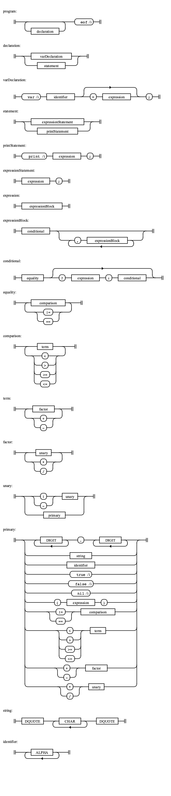

# ilox

[](https://github.com/vguerra/ilox/actions/workflows/ci.yml)

Interpreter for the Lox programming language.

This implementatin is based on the [Crafting interpreters](http://craftinginterpreters.com/) book and it's code snippets.
## Supported syntax

This implementation supports the following:

### Grammar

* Literals
* Unary expressions: Negation of expressions and numbers
* Binary expressions: Infix arithmetic operations and logical operators
* Grouping of expressions via parentheses

```
; Grammar for Lox.

expression  = factor

equality    = comparison *( ( "!=" / "==" ) comparison )

comparison  = term *( ( ">" / ">=" / "<" / "<=" ) term )

term        = factor *( ( "-" / "+" ) factor )

factor      = unary *( ( "/" / "*" ) unary )

unary       = ( "-" / "!" ) unary / primary

primary     = 1*DIGIT "." 1*DIGIT / 1*ALPHA /
              "true" / "false" / "nil" / "(" expression ")"
```

Find the definition in the [lox.abnf](grammar/lox.abnf) file. 

A graphical representation.



#### Operator Associativity

To avoid ambiguity during parsing of expressions, we define the associativity of some binary operators.

| **Operator family** | **Operators** | **Associates** |
|-----------------|-----------|------------|
| Equality        | == !=     | Left       |
| Comparison      | > >= < <= | Left       |
| Term            | - +       | Left       |
| Factor          | / *       | Left       |
| Unary           | ! -       | Right      |
